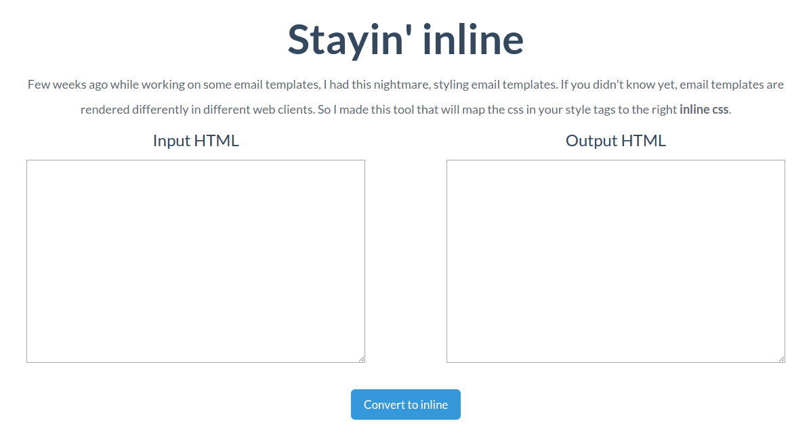

Convert your style tags to inline css for email templates compatible with all email clients.

Paste the HTML of your email template in the left box and get the output with inline style attributes in the right. 
